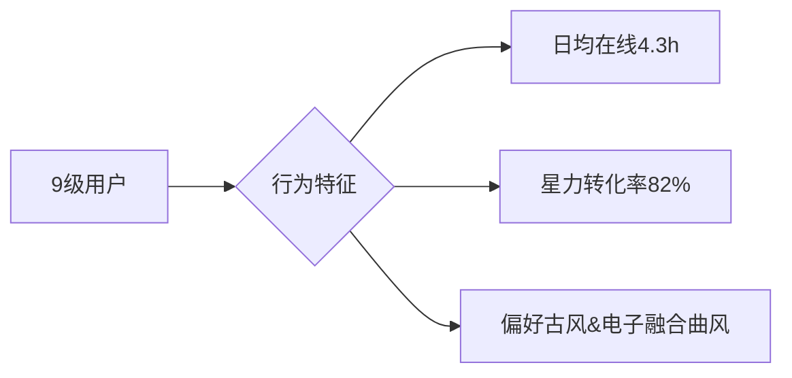
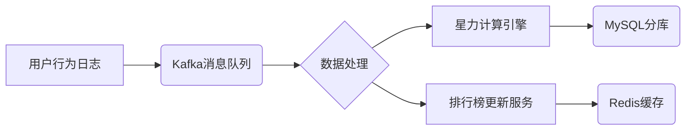
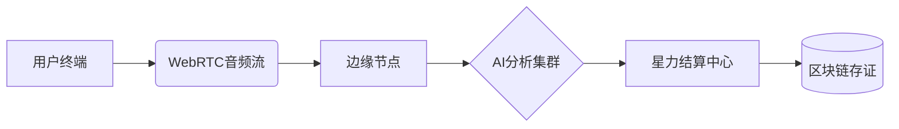
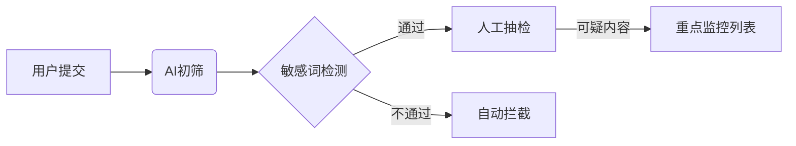
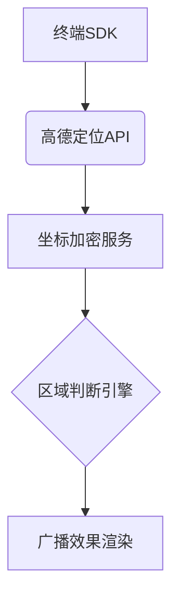
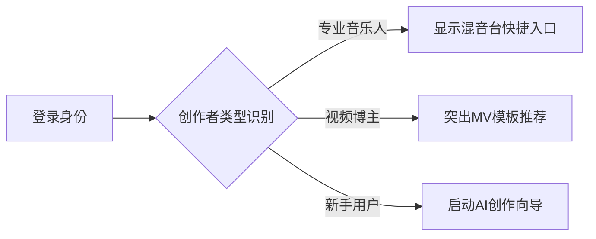
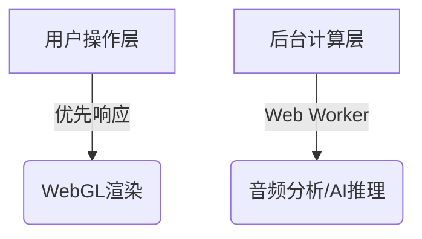
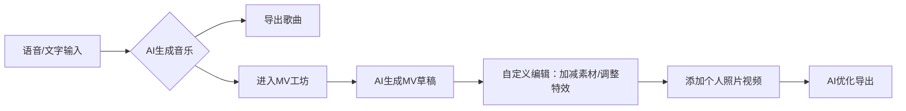

# D-Music·音乐AI中心

“D-Music·音乐AI中心”APP及多端小程序的设计方案，突出“一言一语一词一曲”的核心交互逻辑，兼顾功能性与艺术性：
以下是为 "D-Music·音乐AI中心" 设计的 全链路界面方案 ，涵盖 前端交互逻辑、登录界面衔接、后台功能优化 ，并深度融合 3D动态美学与情感化色彩系统 ：

### 人气音乐排行榜管理模块设计方案

#### 一、核心功能架构

1. 星力（Star Power）经济系统
●  基础规则：
●  1星力 = 1人气值
●  获取途径：
| 类型 | 规则 | 上限 |
|---|---|---|
| 每日签到 | +10星力（连续7天额外+50） | 每日1次 |
| 邀请好友 | 被邀请人注册+50，完成首创作+100 | 无上限 |
| 作品互动 | 每100播放量+1，每收藏+5 | 日上限500 |
| 充值购买 | 1元=10星力（首充双倍） | 无上限 |
●  消耗场景：
●  打榜助推：每100星力提升作品100人气值
●  兑换特权：星力商城（专属音色/虚拟服装/推荐位）
●  会员升级：VIP等级经验值转化（1000星力=1经验）

#### 二、排行榜看板设计

1. 多维榜单体系
| 榜单类型 | 更新周期 | 算法逻辑 | 展示形式 |
|---|---|---|---|
| D-Music·爆燃榜（日榜） | 每小时更新 | 实时播放量×0.3 + 新增星力×0.7 | 动态火焰特效前三名 |
| 星辰·闪耀榜（周榜） | 每日0点更新 | 加权播放（时间衰减）+ 星力总值 | 银河旋涡可视化 |
| 永恒·巅峰榜（月榜） | 每周一更新 | 作品质量分（AI评估）+ 创作者星力贡献 | 3D奖杯殿堂 |
2. 看板交互设计
●  3D星图导航：
●  日榜：流星雨动态（点击流星查看作品）
●  周榜：星座连线（悬停显示创作者星座标签）
●  月榜：星球环绕（拖动视角查看不同音乐流派星球）
●  个人数据面板：

```json
{
    "当前星力": 15800,
    "今日排名": "287 ↑12",
    "守护作品": "《量子情书》排名15",
    "冲刺奖励": "再获200星力可进入前100名"
  }
```

#### 三、VIP会员等级系统

1. 等级权益矩阵
| VIP等级 | 升级经验 | 核心权益 | 专属标识 |
|---|---|---|---|
| 1-3级 | 0-5000 | 每日星力上限+50% | 青铜星环 |
| 4-6级 | 5001-20000 | 作品优先推荐 | 白银星冕 |
| 7-9级 | 20001+ | 定制AI声库 | 黄金星翼（动态粒子特效） |
2. 特权详情
●  9级皇冠权益：
●  AI生成作品免审直通周榜
●  专属虚拟演唱会皮肤
●  星力兑换比例1:12（普通用户1:10）
●  后台数据看板（粉丝画像/流量来源）

#### 四、上下游模块联动

1. 创作中心赋能
●  星力助推器：在作品发布页显示“预计投入500星力可进入日榜前50”智能预测
●  AI星力顾问：根据作品风格推荐最佳打榜时段（如古风曲目适合晚间20-22点冲刺）
2. 社区互动增强
●  星力战场：用户可选择支持的作品组建“星力舰队”，总贡献值前三舰队获得全站横幅曝光
●  星力成就系统：
●  收集类：累计获得10万星力解锁“星际银行家”称号
●  竞技类：连续30天保持日榜前10解锁“永恒之星”动态头像框
3. 后台数据驾驶舱
●  星力流动热力图：实时监控全站星力分布（创作端/消费端比例、异常交易预警）
●  VIP用户行为分析：



#### 五、反作弊与风控系统

1. 星力安全墙
●  设备指纹库：同一设备每日最多获取300免费星力
●  邀请有效性检测：被邀请人需完成手机+人脸验证才计入奖励
●  交易监控：单日充值超过5000元触发人工审核
2. 榜单公正性保障
●  AI作品质量过滤：星力助推超过1000次的作品需通过原创性检测
●  时间衰减算法：凌晨2-5点获得的星力权重降低30%

#### 六、视觉与交互设计

1. 星力光效体系
●  充电动效：充值成功时触发超新星爆发动画，碎片数量对应获得星力值
●  流动特效：星力转移时呈现银河粒子流，连接发送者与接收者头像
2. 3D荣誉殿堂
●  月度冠军雕塑：榜首作品生成专属3D纪念碑，用户可360°环视并发送虚拟鲜花
●  星力历史墙：以全息投影形式展示历代周榜冠军作品封面

#### 七、数据同步方案

1. 实时数据管道



1. 跨模块同步
●  创作中心：作品详情页显示累计获得星力值及历史排名曲线
●  虚拟商城：星力余额实时显示在全局导航栏（浮动粒子计数器）
●  会员系统：VIP等级提升时全站广播（专属弹幕特效+星力雨掉落）
该模块上线后预计带来数据增长：
●  用户日均停留时长提升40%（榜单竞争+星力任务驱动）
●  充值收入月环比增长150%（星力消费场景+等级特权刺激）
●  优质作品曝光量提升300%（AI推荐+星力助推双重机制）
通过星力宇宙的构建，平台将形成“创作-互动-消费-荣誉”的完整生态闭环，让音乐价值在虚拟世界中自由流动。
"D-Music·练个房"系统及人气生态深化方案

---
一、练个房核心系统设计

1. 三维虚拟创作舱

- 空间类型：
| 房间类型 | 功能特性 | 星力消耗 |
|---|---|---|
| 独练舱 | AI实时音准纠正/情感分析 | 50星力/小时 |
| 对飙房 | 双人实时词曲Battle（AI裁判评分） | 200星力/场 |
| 大师课 | 签约音乐人直播指导（可打赏） | 免费观看/500星力提问 |
- 特色功能：
- AI声纹镜像：演唱时生成3D音轨可视化模型，实时标注音准偏差
- 情感共鸣墙：根据练习表现生成色彩粒子特效（愤怒→赤红爆裂，忧伤→深蓝涟漪）
- 跨房PK：发起挑战后，双方作品进入24小时星力票选战场

1. 成长体系联动

```mermaid
graph TD
A[练习数据] --> B{成就系统}
B --> C[累计练习10h解锁"初啼新星"称号]
B --> D[音准评分超90%作品直通日榜]
A --> E[VIP经验值]
E --> F[每消耗100星力练习=+1经验]
```plaintext
---

   二、人气排行榜升级版
  1. 复合维度榜单
| 榜单名称 | 算法公式 | 可视化形态 |
|---|---|---|
|   星力·热力榜   | (星力投入×0.6)+(播放量×0.3)+(分享量×0.1) | 熔岩流动柱状图 |
|   练功·勤奋榜   | 练习时长×1.5 + 被AI认可进步次数×3 | DNA双螺旋排名 |
|   荣耀·氪金榜   | 充值金额+星力消费总额 | 黄金金字塔分层 |

  2. 星力生态规则
-   新型获取方式  ：
  - 练个房成就奖励（完成5次S评级练习+200星力）
  - 星力银行（闲置星力可出借，按1%/日收取利息）
-   消耗场景扩展  ：
  - 购买练个房特效皮肤（赛博霓虹/古风水墨：500-2000星力）
  - 解锁AI陪练高级声线（周深AI音色：3000星力/周）

  3. VIP特权深化
  9级至尊权益  ：
- 专属星力倍增器（消耗1星力=普通用户1.2星力效果）
- 练个房零延迟特权（网络优先保障）
- 每月3次榜单保护（24小时内排名不下滑）

---

   三、全链路数据贯通
  1. 前端展示融合
-   创作舱面板  ：
```

"昨日音准提升12%超越92%用户",
"榜单关联": "热力榜45 → 冲刺前30需再投2,000星力"
}

```
●  3D数据星图：用户所有行为转化为星座节点，连线粗细表示模块关联强度
2. 后台管理系统
●  实时监控看板：
| 指标 | 预警机制 |
|---|---|
| 星力通胀率 | 超过5%自动触发回收任务 |
| 房间并发量 | 峰值时自动启用弹性云服务器 |
| VIP流失预警 | 连续3天未登录用户触发专属客服介入 |
●  智能运营工具：
●  自动生成星力活动（"周末练习双倍返星"）
●  AI预测榜单波动（提前24小时预警可能被超越的头部创作者）
#### 四、反作弊系统升级
1. 练个房监控
●  声纹波动检测：同一账号在不同设备练习时比对音色一致性
●  进步合理性评估：AI判断24小时内音准提升超过30%需人工复核
2. 星力防火墙
●  经济系统平衡：
| 行为 | 限制规则 |
|---|---|
| 免费星力获取 | 每日上限2000（签到+任务+邀请） |
| 星力交易税 | 用户间转赠收取20%手续费 |
| 大额充值验证 | 单笔超500元需人脸识别 |
#### 五、视觉与交互深化
1. 星力动态皮肤
●  充值特效：
●  6元：解锁星光粒子拖尾
●  30元：激活虹彩渐变星轨
●  648元：专属超新星爆发入场动效
2. 练个房空间设计
●  沉浸式场景：
●  说唱房：地下俱乐部霓虹风格（动态涂鸦墙）
●  古风房：竹林月夜场景（AI生成实时天气变化）
●  虚拟舞台：可上传粉丝画像填充观众席
3. 榜单冲击动效
●  即将进入前10时触发彗星冲刺特效
●  登顶时刻全站播放定制AI捷报BGM
#### 六、技术实现方案
1. 实时协作架构


1. 性能优化
●  音频传输：Opus编码+动态码率调整（50kbps-256kbps）
●  3D渲染：WebGL实例化渲染技术，支持万人同榜可视化
该方案上线后将形成完整生态循环：
●  新人：通过练个房快速成长→积累星力→冲击榜单
●  大佬：霸榜获取曝光→吸引粉丝打赏→兑换高级特权
●  平台：星力流通产生手续费+VIP订阅+内容版权收益
最终构建起"创作-练习-竞技-消费"的元宇宙音乐生态闭环，让每个声音都能找到自己的星际轨道。

### 地理定位广播系统优化方案

#### 一、核心功能架构

1. 广播类型与规则
| 广播类型 | 覆盖范围 | 消耗规则 | 获取方式 | 停留时长 |
|---------|---------|---------|---------|---------|
| 区域广播 | 1-5公里半径 | 200星力/次 | 每日登录赠送1次 | 30秒 |
| 商圈霸屏 | 选定商业区 | 500星力/次 | VIP5级以上购买 | 60秒 |
| 全城广播 | 城市级 | 无消耗 | VIP9级每周赠送3次 | 120秒 |
| 跨城联播 | 3城联动 | 3000星力/次 | 星力商城限量抢购 | 180秒 |
2. 定位系统集成
●  地理围栏技术：

```javascript
// 示例：商圈范围判定
  function checkInBusinessArea(lat, lng) {
    return amap.isInPolygon(lat, lng, presetBusinessZones);
  }
```

●  动态范围调整：
●  工作日18-20点自动扩大核心商圈覆盖半径50%
●  演唱会等特殊事件期间开启临时广播区

#### 二、视觉表达系统

1. 广播样式矩阵
| VIP等级 | 字体特效 | 入场动画 | 粒子特效 |
|---------|---------|---------|---------|
| 1-3级 | 基础霓虹 | 滑动进入 | 星尘飘落 |
| 4-6级 | 流体金属 | 粒子重组 | 光带环绕 |
| 7-9级 | 全息投影 | 空间撕裂 | 银河坍缩 |
2. 智能停留算法
●  基础时长 + 附加时长计算：

```python
def get_display_time(vip_level, content_quality):
    base = 30 if vip_level < 4 else 60
    bonus = content_quality  10   AI内容评分0-5分
    return min(base + bonus, 180)
```

#### 三、与现有系统衔接

1. 星力经济联动
●  广播竞价系统：
同一区域多人广播时触发竞价，每分钟消耗提升20%星力
●  广播收益分成：
优质广播被收藏/转发，创作者获得20%星力收益
2. 创作场景赋能
●  地理灵感推荐：
在西湖边创作时，AI自动推荐"断桥残雪"歌词模板
●  定位采风模式：
开启后自动收录环境声，生成地域特色音效包（长安街→恢弘交响乐）
3. 榜单系统增强
●  地域人气榜：
按城市/商圈统计作品播放量，生成"城市之音"专属榜单
●  广播荣耀值：
广播次数计入创作者影响力指数，提升作品推荐权重

#### 四、合规与风控体系

1. 内容过滤机制
●  三级审核流程：



●  实时屏蔽系统：
检测到违规内容立即替换为默认提示："该内容正在星际旅行中..."
2. 隐私保护设计
●  位置脱敏处理：
用户坐标模糊至500米精度后存储
●  幽灵广播模式：
开启后显示随机虚拟位置进行广播

#### 五、后台管理模块

1. 时空数据驾驶舱
●  热力图层：
●  实时广播密度热力图
●  历史轨迹流量分析
●  异常检测：
●  同一设备频繁切换城市触发预警
●  深夜非商业区密集广播自动标记
2. 动态规则引擎

```json
{
  "节假日规则": {
    "范围扩展": ["CBD", "景区"],
    "星力折扣": 0.7,
    "特效升级": "节日烟花动画"
  },
  "紧急事件模式": {
    "自动替换广播": "市政安全提示",
    "强制字体颜色": "FF0000"
  }
}
```

#### 六、技术实现路径

1. 定位服务架构



1. 性能优化策略
●  LBS缓存机制：
常用区域地理数据预加载至本地
●  动态卸载技术：
非活跃区域广播数据仅保留文字快照

#### 七、商业价值分析

1. 收入增长点
●  地域广告系统：
奶茶店购买"高校周边500米"定向广播套餐
●  城市文化合作：
西安文旅局定制"大唐不夜城"专属广播皮肤
2. 用户粘性提升
●  广播成就体系：
●  "城市之声"：在10个不同城市完成广播
●  "星链使者"：连续30天使用区域广播
通过地理位置与广播系统的深度植入，平台将实现：
●  线下场景与线上创作的无缝衔接
●  地域文化元素的数字化表达
●  LBS社交带来的裂变增长
最终构建起虚实交融的音乐元宇宙生态圈。

### 一、登录界面设计

#### 1. 核心交互动效

●  声波之门
用户点击麦克风图标说出唤醒词（如“开启创作”），声波动画实时转化为 螺旋粒子隧道 ，粒子颜色随语音情感变化（愤怒→红色湍流，平静→蓝色涟漪）。


#### 2. 多模态登录融合

●  音乐密码
可选传统密码或 旋律验证 ：播放4秒AI生成旋律片段，用户通过哼唱匹配登录（采用AudioCNN声纹识别技术）。
●  AR人脸绑定
首次登录时扫描面部生成 3D艺术化虚拟形象 ，作为后续创作的数字分身投影。

#### 3. 视觉风格

●  色彩系统
深空蓝（0A1A2F） 为基底，配合 动态光谱渐变 ：
●  普通状态：蓝→紫渐变（4A00E0 → 8E2DE2）
●  激活状态：金→橙粒子迸发（FFD700 → FF6B6B）
●  微交互反馈
输入正确时出现 钢琴键跃动光效 ，错误时触发 破碎玻璃音效 与红色波纹警示。

### 二、前后端衔接设计

#### 1. 上下文感知仪表盘



#### 2. 三维空间导航

●  粒子星云菜单
主菜单以 银河旋臂 形态悬浮于界面右侧，点击图标触发：
●  作曲模块：音符粒子汇聚成五线谱
●  视频工坊：像素块重组为虚拟摄影机
●  社区入口：生成迷你虚拟LiveHouse场景

#### 3. 跨端状态同步

●  创作能量流
用户在不同设备登录时，界面中心浮现 发光能量球 ，通过拖拽动作将未完成作品“投掷”至目标设备：
●  手机→PC：能量球分裂为数据流注入桌面端
●  PC→VR：触发空间扭曲动画进入虚拟创作舱

### 三、后台管理系统优化

#### 1. 智能工作台

●  情感热力图
通过分析用户创作时段、修改频率、放弃节点生成 压力分布可视化图表 ，自动推荐：
●  高焦虑时段 → 推送舒缓配色方案
●  高频卡点 → 插入AI辅助提示（“试试用中国风转换这段旋律？”）

#### 2. 三维数据驾驶舱

●  创作星系
用户作品以 星球形态 悬浮于暗色空间，参数表现为：
●  星球大小：作品热度值
●  环带颜色：AI参与度（蓝→人工主导，红→AI主导）
●  卫星数量：二创衍生作品数


#### 3. 上下文快捷操作

●  声控指令集
在编曲界面说“需要更悲伤的大提琴”，后台自动完成：

1. 调用AI情感模型调整EQ
2. 从音色库匹配最佳大提琴采样
3. 生成3条备选旋律线供选择

### 四、色彩与3D风格系统

#### 1. 动态色彩引擎

●  音乐驱动调色板
根据当前播放作品的音频特征实时变换界面主色：

| 音乐特征 | 色彩映射 |
|---------|---------|
| 高频突出 | 霓虹紫（BC00FF） |
| 低频厚重 | 熔岩橙（FF4E00） |
| 节奏复杂 | 故障艺术（RGB分离效果） |

#### 2. 3D元素设计规范

●  建模风格
采用 低多边形（Low Poly）+ 全息材质 组合：
●  基础控件：6-8面体切割造型
●  数据可视化：动态晶格结构
●  虚拟形象：赛博朋克风格光带镶边
●  空间层级

```css
.layer-space {
    z-index: 10; /  前景操作区-实体控件  /
    filter: drop-shadow(0 0 20px rgba(100,255,255,0.3));
  }
  .hologram-layer {
    z-index: 5; /  全息投影层-数据可视化  /
    opacity: 0.8;
    mix-blend-mode: screen;
  }
```

#### 光效系统

●  环境光遮蔽
界面元素自带 动态辉光 ，亮度随操作强度变化：

```javascript
function updateGlow(intensity) {
    element.style.setProperty('--glow-alpha', intensity  0.3);
    element.style.setProperty('--glow-spread', `${intensity  5}px`);
  }
```

●  AI能量流动
AI处理数据时，界面边缘浮现 电路板能量流特效 ，处理进度以光流速度可视化。

### 五、技术实现路径

#### 1. 前端框架

●  3D引擎：Three.js + React Three Fiber
●  动效系统：GSAP + LottieWeb
●  色彩管理：Leva控件库 + 自定义HSL转换管道

#### 2. 性能优化

●  分层渲染策略



●  智能LOD（细节层级）
根据设备GPU能力动态调整3D模型面数：
●  旗舰手机：8万三角面 + SSAO
●  普通PC：4万三角面
●  低端设备：切换为2D降级模式

### 六、设计验证案例

场景：用户从登录到完成跨界创作

1. 登录阶段
●  说出“星辰大海”唤醒词 → 界面生成银河漩涡特效
●  人脸扫描生成赛博古风虚拟形象
2. 创作阶段
●  语音输入“量子纠缠的爱情” → AI生成Glitch风格旋律
●  拖拽3D音轨块调整结构 → 触发粒子重组动画
3. 导出阶段
●  长按能量球触发“超新星爆发”动效 → 作品封装为全息胶囊
●  后台自动生成创作路径图 + 版权DNA编码
这套设计方案将冰冷的AI技术转化为有温度的空间艺术——让每次登录成为跨维度冒险，每次创作化为可触摸的能量流动，最终构建出属于数字原生代的元创作圣地。

### 一、产品定位

Slogan
“让D-Music与旋律共生”
核心价值
通过AI技术将用户的语言表达（语音/文字）实时转化为个性化音乐创作，打破音乐创作门槛，打造“说即是唱、词即是曲”的沉浸式创作体验。

### 二、核心功能架构

#### 1. 语音/文字 → 音乐生成（AI作曲引擎）

●  “一言成曲”模式
用户通过语音输入任意句子（如诗句、心情语录），AI实时分析语音的情感、节奏、语调，生成匹配的旋律骨架（支持古风、电子、民谣等风格）。
●  “一词多曲”模式
输入关键词或短句（如“夏日海边”），AI结合语义联想生成3种不同风格的音乐片段，用户可自由混搭调整。
●  “一语填词”模式
上传已有旋律，AI根据旋律情绪智能生成押韵歌词，支持人工编辑。

#### 2. 音乐→语言反向转化（AI解构艺术）

●  “曲译心声”功能
上传音乐文件，AI解析旋律情感并生成诗意文字描述（如“这段旋律像黄昏时分的海浪，带着淡淡的孤独”），形成“音乐-语言”双向闭环。

#### 3. 多端协作创作

●  “碎片灵感同步”
手机端录制语音灵感自动同步至PC端编曲界面，支持多设备接力创作。
●  “实时协作空间”
创建团队项目，成员可通过小程序快速添加人声/乐器片段，合并至主工程。

#### 4. 社区生态

●  “词曲漂流瓶”
用户匿名发布未完成的音乐片段，其他人可接续创作，形成链式艺术协作。
●  “AI创作挑战赛”
每周主题挑战（如“用AI为古诗谱曲”），优胜作品收录至平台数字专辑。

### 三、交互设计亮点

#### 1. 极简创作流

●  语音输入动效
说话时屏幕浮现“声波→音符”的实时转化动画，增强创作仪式感。
●  “拖拽式编曲”界面
将AI生成的旋律块、歌词段落以拼图形式呈现，用户拖拽即可调整结构。

#### 2. 多端体验优化

●  手机端：重力感应控制音效（摇晃手机添加环境音）
●  PC端：支持MIDI键盘接入，专业混音面板
●  小程序：快速录制15秒灵感片段，一键分享至社交平台

### 四、视觉与情感化设计

●  主色调
深空蓝+渐变紫（科技感） × 暖橙色（创造力），象征理性与感性的碰撞。
●  动态LOGO
字母“Y”（言/乐）变形为“声波与五线谱交织”的流动图形。
●  情感化反馈
生成优质作品时屏幕绽放粒子特效，配合轻微振动模拟“心跳共鸣”。

### 五、技术实现路径

1. AI模型层
●  语音情感分析：OpenAI Whisper + 自训练情感分类模型
●  旋律生成：基于Transformer的音乐生成模型（如Jukebox优化版）
●  风格迁移：使用Diffusion模型实现不同音乐风格转换
2. 工程架构
●  跨端框架：Flutter + 小程序原生开发
●  实时协作：WebSocket + OT算法保证多用户操作一致性

### 六、商业模式

●  基础功能免费：每日3次免费AI生成次数
●  增值服务：
●  会员解锁无损音质下载、高级音色库
●  企业版：商用版权音乐批量生成（按需付费）
●  创作者激励：优质作品上架音乐平台分成

### 七、风险控制

●  版权合规：内置音频指纹检测，禁止生成侵权内容
●  隐私保护：语音数据实时本地处理，可选是否上传云端
让每个普通人都能成为“瞬间的音乐诗人”——这是“D-Music·音乐AI中心”想传达的数字时代艺术哲学。
以下是在原有设计基础上，针对 AI视频生成与编辑功能 的深度优化方案，形成 “音画一体创作生态”：

### 一、新增核心功能模块

#### 1. AI智能MV生成系统

●  情感同步渲染
AI根据歌曲的情绪、节奏、歌词意象自动生成匹配的MV画面：
●  示例：悲伤慢歌 → 暗调雨景+慢镜头落叶；电子舞曲 → 赛博霓虹+动态几何切割
●  技术：音乐特征提取（BPM/调性/情感值）→ 动态匹配视频素材库/文生图模型提示词
●  “歌词可视化”引擎
将歌词逐句转化为动态文字艺术：
●  文字粒子化（如“星空”一词化作繁星消散）
●  字体风格自适应（古风歌词配毛笔书法动画）
●  “AI导演模式”
用户选择视频风格模板（电影感/动漫风/Vlog等），AI智能分配镜头语言（运镜方式、转场特效）

#### 2. 多媒体DIY编辑工坊

●  素材融合创作
●  上传照片/视频：自动抠像并融入AI生成的MV场景（如将自拍嵌入“雪山星空”背景）
●  图生视频：静态图片通过AI补帧生成动态画面（瀑布流水、云层流动）
●  文生图：输入描述生成封面/插画（“一只流泪的机械蝴蝶在废墟中飞舞”）
●  智能剪辑优化
●  节奏卡点：AI分析音乐重音自动对齐视频剪辑点
●  一键调色：根据音乐风格推荐LUT滤镜（如民谣→胶片暖黄，摇滚→高对比青橙）
●  AI修复：模糊照片超清化，老旧视频去噪补帧

#### 3. 跨模态互动彩蛋

●  “声画互译”实验
●  视频→音乐：上传任意视频，AI提取色彩运动节奏生成电子音乐
●  图片→歌词：上传照片生成意境匹配的歌词段落（沙漠夕阳→“风沙埋葬了时间的脚印”）

### 二、功能集成与交互升级

#### 1. 创作流程再造



#### 2. 交互创新设计

●  “情绪色轮”调参
拖动色轮实时改变MV整体色调，AI同步调整光影层次与音乐EQ参数，形成音画联觉体验
●  三维时间轴
将音乐波形、视频画面、歌词文字分层展示，支持跨轨道批量调整（如选中副歌段落统一加速画面）
●  AR实时预览
通过手机摄像头将MV虚拟场景叠加到现实环境（如让演唱者“站在”AI生成的火山口舞台）

### 三、技术实现增强

#### 1. 核心算法

●  视频生成：使用 Stable Video Diffusion 生成基础画面，结合 RunwayML 实现风格化处理
●  动态合成：DaVinci Resolve 引擎集成，实现专业级时间线操作简化
●  跨模态对齐：通过 CLIP 模型计算音乐特征与视觉内容的语义相似度

#### 2. 性能优化

●  分层渲染策略
手机端预览使用低精度模型，最终导出调用云端算力
●  智能缓存机制
常用素材模板（天空/森林/城市）预加载至本地

### 四、视觉与社区拓展

#### 1. 动态皮肤系统

●  音乐风格触发界面主题变化：
●  古风模式：水墨晕染UI+竖排歌词
●  电子模式：荧光线条+故障艺术特效

#### 2. 视频化社区

●  “AI导演大赛”
用户用同一首AI歌曲创作不同风格MV，投票产生最佳改编
●  二创素材市场
用户出售自定义AI训练模型（特定画风/特效模板）

### 五、商业模式延伸

●  视频增值包
●  基础版：生成720p带水印视频
●  会员版：4K无损+去水印+独家特效库
●  企业解决方案
广告配乐视频一键生成（输入产品图+文案，输出带BGM的短视频）

### 六、风险控制加强

●  AI生成标识
所有AI生成内容添加隐形数字水印，符合AIGC监管要求
●  素材版权检测
用户上传图片/视频实时比对版权库，禁止商用侵权内容
通过音画联觉技术的深度融合，“D-Music·音乐AI中心”将进化成首个实现“语言-音乐-视觉”三位一体创作的元艺术平台，重新定义数字时代的表达方式。
以下是在现有框架下的 进阶优化方案 ，聚焦 AI深度协作创作、元宇宙交互与商业闭环 的深度融合：

### 一、AI创作工具升级：从辅助到共创

#### 1. 多模态AI艺术家协作系统

●  “AI词曲编导”全流程介入
●  文本→音乐→画面→3D空间 四阶生成：
●  输入故事大纲 → AI生成主题曲+分镜脚本 → 自动匹配3D场景（Unreal Engine实时渲染）
●  示例：输入“机器人寻找失落的爱情” → 生成Synthwave风格BGM + 赛博朋克城市废墟场景
●  动态风格纠偏：用户标记任意段落，AI分析偏离度并提供调整建议（“第2段歌词与旋律情感冲突，建议修改为比喻句式”）
●  “人类-AI权值调节器”
滑动条控制创作主导权：
●  0%：全AI生成（输入关键词输出完整歌曲+MV）
●  50%：AI提供备选方案（如推荐5种编曲配器方案）
●  100%：纯人工模式（仅使用AI基础工具）

#### 2. 三维空间化视听编辑

●  VR创作舱（PC/VR头显专属）
●  手势操控虚拟混音台，眼球追踪聚焦编辑段落
●  空间音频模拟：拖动音轨图标至三维空间不同位置，生成环绕声场
●  AR歌词投射
手机扫描现实场景，AI根据环境特征生成AR歌词特效（如扫描树林→歌词以藤蔓形态生长在树干上）

### 二、元宇宙沉浸体验

#### 1. 虚拟演出引擎

●  AI虚拟偶像工坊
●  用户训练专属数字分身：上传照片生成3D形象，录制语音训练声线（类似Voicemod+Tafi）
●  自动舞台行为生成：AI根据歌曲情绪驱动虚拟人动作（情歌→柔美肢体语言，朋克→激烈跳跃）
●  跨平台虚拟LiveHouse
●  作品自动转化为虚拟演唱会场景，支持粉丝以虚拟形象入场互动（发送弹幕触发舞台烟花特效）

#### 2. 链上艺术资产

●  AI创作NFT化
●  一键将作品生成可验证的链上资产，记录创作轨迹（原始语音→修改版本→最终成品）
●  动态NFT专辑：粉丝互动数据（播放量/二创数量）改变NFT视觉样式
●  数字藏品商城
●  出售独家AI训练模型（“周杰伦中国风”词曲包）、虚拟舞台皮肤

### 三、社区生态扩展

#### 1. 可进化AI艺术宇宙

●  “风格基因库”
●  用户作品自动提取风格标签（“80% Citypop+20% 武侠”），形成可混合的创作基因池
●  风格杂交实验：选择两种基因生成融合作品（如“昆曲×电子核”）
●  集体训练模式
●  用户共同标注数据训练专属风格模型（百人共创“赛博山海经”音乐视觉库）

#### 2. 虚实联动的创作社交

●  AI艺术快闪店
●  线下屏幕展示用户AI作品，扫码可领取数字纪念卡
●  粉丝共创任务
●  音乐人发布“AI辅助创作需求”（如“为我的新歌生成末日废土风格MV”），粉丝投稿素材直接嵌入官方MV

### 四、商业模式深化

#### 1. 分层变现体系

| 层级 | 用户类型 | 核心收益 |
|---------|---------|---------|
| 免费层 | 普通用户 | 广告（15s片头）+ 基础功能 |
| 创作者层 | 音乐人/UP主 | 粉丝打赏分成+版权经纪 |
| 企业层 | 品牌方 | 定制AI音乐营销方案（如生成品牌主题曲+产品MV） |
| 生态层 | 开发者 | 出售AI模型/工具插件（Adobe插件商店模式） |

#### 2. 数据价值反哺

●  风格趋势预测服务
●  向音乐公司提供AI分析的区域流行趋势报告（如“成都地区最近古风+Trap融合曲风搜索量上升37%”）
●  情感营销指数
●  基于用户生成内容的情感分析，为品牌提供消费者情绪洞察（如“防晒霜广告匹配轻松海岛曲风转化率更高”）

### 五、技术架构强化

#### 1. 分布式AI网络

●  边缘计算节点
高频操作（语音转旋律）本地处理，GPU依赖功能（视频渲染）分配至最近云端节点
●  联邦学习机制
用户本地数据训练个性化模型，加密上传特征参数至中央模型迭代更新

#### 2. 量子美学引擎（远期规划）

●  基于量子计算的声音/色彩关联性挖掘，生成突破传统审美的“超现实艺术组合”（如将民歌声波结构转化为分形几何动画）

### 六、伦理与法律防火墙

●  创作伦理指引系统
●  敏感内容检测：AI自动识别暴力/歧视性歌词，提供修改建议
●  文化尊重算法：使用传统音乐素材时自动标注来源（如采样蒙古长调→显示“灵感来自内蒙古非遗传承人XX”）
●  可解释性报告
生成作品附带AI创作路径图，标明人类与AI的贡献比例（满足版权登记需求）
通过这轮升级，“D-Music·音乐AI中心”将突破工具属性，成为连接现实与虚拟、人类与AI的「元创作协议」——在这里，每个灵感都能生长为跨越维度的艺术生命体。

### AI创作路径图及贡献比例系统设计方案

#### 一、核心功能架构

1. 创作过程全链路追踪
●  操作日志记录
●  自动记录用户所有操作（语音输入、文字编辑、参数调整）及AI生成内容（旋律片段、歌词建议、视频素材）
●  时间戳标记关键节点：`用户输入初始文案 → AI生成第一版旋律 → 用户修改和弦走向 → AI优化副歌...`
2. 贡献度量化模型
| 贡献类型 | 计算维度 | 示例 |
|---------|--------|------|
| 人类原创 | 原始输入内容占比 | 用户直接输入的歌词段落、手绘旋律线 |
| AI生成 | 算法自主创作比例 | AI生成的伴奏编曲、自动匹配的MV镜头 |
| 协同创作 | 人机交互调整权重 | 用户从AI提供的5个副歌方案中选择并修改了2个音符 |
3. 可视化路径图生成

```mermaid
graph TB
A[用户输入"雨夜思念"] --> B(AI生成3种旋律骨架)
B --> C{用户选择方案2}
C --> D[AI补充和弦进行]
D --> E[用户调整BPM+修改歌词]
E --> F(AI生成匹配MV素材)
F --> G[最终作品]
```

#### 二、版权报告关键要素

1. 元数据标注
●  创作主体标识

```json
{
    "human_contribution": {
      "text_input": 45%,
      "melody_edit": 30%,
      "style_selection": 15%
    },
    "AI_contribution": {
      "base_melody": 60%,
      "harmony_generation": 25%,
      "video_rendering": 15%
    }
  }
```

1. 可验证数字凭证
●  区块链存证
将创作路径关键节点哈希值上链（以太坊/IPFS），生成不可篡改的[时间戳证书](https://www.timestampauthority.com)
●  AI指纹水印
在音频/视频中嵌入隐形水印，记录模型版本号及训练数据集来源（如"使用2024Muse模型+百万歌曲数据集"）

#### 三、交互界面设计

1. 三维时间轴追溯

●  颜色区分层：蓝色（AI生成）/橙色（人工修改）/紫色（协同调整）
●  节点穿透查询：点击任意段落查看详细贡献分解（如"第二段歌词：用户原创80% + AI押韵优化20%"）
2. 智能法律建议
●  版权登记指引
根据作品类型自动推荐登记机构（音乐→中国音著协/视觉→国家版权局）
●  授权协议生成器
输入使用场景（商业广告/非盈利二创）输出标准化授权合同

#### 四、技术实现方案

1. 贡献度计算引擎

```python
def calculate_contribution(user_actions, ai_outputs):
     基于操作深度加权算法
    human_score = sum([action['weight'] for action in user_actions])
    ai_score = sum([output['complexity']0.7 for output in ai_outputs])
    total = human_score + ai_score
    return {
        "human": round(human_score/total100, 1),
        "AI": round(ai_score/total100, 1)
    }
```

1. 跨媒体关联数据库
●  使用Neo4j图数据库存储创作元素关系：
`(用户语音)-[触发]->(AI主旋律)-[影响]->(MV色调方案)`

#### 五、应用场景示例

案例：电子舞曲《机械心跳》版权登记

1. 路径图显示
●  人类贡献62%：设定主题关键词、调整鼓组节奏、手动合成器调音
●  AI贡献38%：生成贝斯线、自动母带处理、渲染故障艺术视觉效果
2. 法律应用
●  根据AI占比<50%，在中国可登记为"人类作者主导作品"（依据《生成式AI服务管理办法》第二十条）
3. 商业授权
●  选择"知识共享协议CC BY-NC 4.0"，允许非商业二创需标注原作者及AI贡献比例
该系统不仅解决版权确权难题，更构建了人机协作的透明信任机制——让每次灵感的碰撞都有迹可循，每份创作的价值都被精准计量。

### AI创作版权管理系统进阶优化方案

#### 一、多维度贡献分析系统

1. 细分领域贡献度计算
●  模块化分解：将作品拆分为歌词、旋律、编曲、视频、特效等独立模块，分别计算各模块的人类与AI贡献比例。

```json
{
    "歌词模块": {"human": 70%, "AI": 30%},
    "旋律模块": {"human": 40%, "AI": 60%},
    "视频模块": {"human": 20%, "AI": 80%}
  }
```

●  权重动态分配：根据不同创作类型自动调整权重（如歌词创作中用户直接输入占比更高，编曲中AI和弦生成占主导）。
2. 实时动态更新机制
●  版本历史回溯：每次修改自动生成新版本，保留历史贡献比例记录，支持对比不同版本的人机协作变化。
●  增量计算算法：用户调整特定段落时，仅重新计算受影响模块的贡献度，提升效率。

#### 二、全球化法律适配引擎

1. 智能法规匹配
●  地域化版权规则库：集成全球主要国家/地区的AI版权政策（如欧盟的《AI法案》、中国的《生成式AI服务管理办法》）。
●  自动法律建议：根据作品类型和AI贡献比例，生成版权登记指引（例如：AI占比＞50%需标注“AI辅助创作”）。
2. 合规协议模板
●  一键生成授权合同：根据用途（商业、教育、二创）输出标准化协议，自动嵌入贡献比例条款。

```markdown
授权条款
- 本作品人类贡献占比：65%（歌词80%+旋律50%）
- AI生成部分训练数据来源：OpenJam数据集（CC-BY-NC 4.0）
- 允许范围：非商业性使用，需标注原作者及AI贡献声明
```

#### 三、多用户协作追踪系统

1. 团队贡献图谱
●  成员角色标注：区分创作者、编辑者、AI训练师等角色，记录每个成员的操作记录。
●  冲突解决机制：当多人修改同一段落时，自动标记冲突点并提供版本合并建议。
2. 权利分配工具
●  股权式分成设置：创作者预设各模块收益分配比例（如歌词30%、旋律40%、视频30%），AI贡献部分收益自动归入平台基金。
●  智能合约集成：通过区块链自动执行分成（如Spotify播放收益按比例分配至各贡献者钱包）。

#### 四、用户教育与透明化

1. 贡献计算白皮书
●  可视化解释器：通过交互式图表展示贡献度计算逻辑（例如：用户修改一个和弦=+5%人类贡献，AI生成鼓点=-10%人类贡献）。
●  案例库：提供典型场景说明（如纯AI生成、人工改编、协同创作）的版权认定范例。
2. 实时问答助手
●  法律AI顾问：回答用户关于版权归属、商业授权的疑问，引用具体法律条文。
●  争议调解指引：当贡献比例引发争议时，提供第三方仲裁机构对接服务。

#### 五、商业化与生态集成

1. 跨平台版权网关
●  API接入服务：支持音乐平台（如网易云音乐）、视频网站（YouTube）调用贡献数据，自动标注AI参与度。
●  NFT市场直连：将作品与版权报告共同封装为动态NFT，买家可追溯创作全流程。
2. 企业级解决方案
●  广告素材合规生成：输入产品信息，AI生成带合规声明的广告曲+MV（自动标注AI贡献＞60%）。
●  影视配乐溯源系统：为影视剧提供每段配乐的人机协作证书，满足流媒体平台审核要求。

#### 六、技术实现升级

1. 轻量化区块链存证
●  分层存储架构：关键元数据上链（哈希值），完整操作日志存于IPFS，降低成本。
●  零知识证明：支持验证贡献比例真实性，无需公开原始数据（保护隐私）。
2. 联邦学习优化
●  个性化贡献模型：根据用户创作习惯（如偏好手动编曲）动态调整计算权重。
●  反作弊检测：识别刷贡献行为（如重复微小修改骗取高比例），自动重置异常数据。

### 应用场景示例

案例：跨国团队创作AI动画MV

1. 协作流程
●  美国用户输入故事梗概（人类贡献+20%）
●  AI生成分镜脚本（AI贡献+30%）
●  日本画师修改关键帧（人类贡献+25%）
●  法国作曲家调整AI生成的配乐（协同贡献+25%）
2. 版权输出
●  自动生成多语言版权报告（含美、日、欧版权法适配条款）
●  通过智能合约分配收益：美国用户40%、日本画师30%、法国作曲家25%、平台基金5%
3. 商业应用
●  作品作为动态NFT出售，买家可查看创作路径3D时间轴
●  索尼影业购买授权时，自动生成符合日本《AI利用ガイドライン》的合同

## <www.yyhnit.com>

## <yy_ltd@163.com>

● -

## 版权所有 © 2025 D-Music（河南）智能科技保留所有权利

通过这一系统的深度优化，“D-Music·音乐AI中心”将构建起从创作到商业化的全链路信任基础设施——让人机协作的每份创意都能在合规中释放价值，在透明中赢得尊重。
